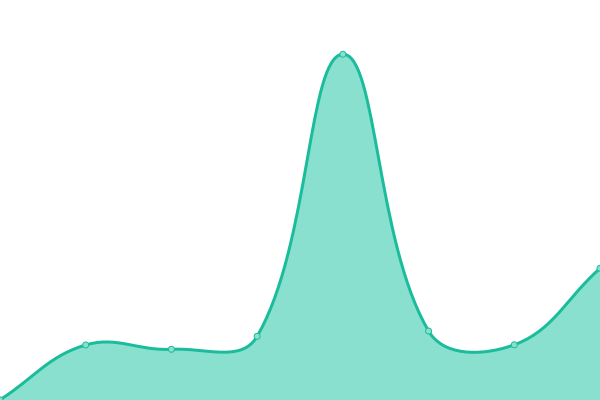
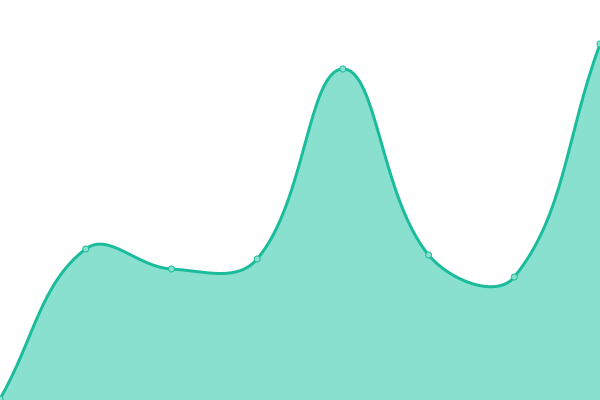

# [📈 Live Status](https://bitjbullock.github.io/Uptime2): <!--live status--> **🟧 Partial outage**

This repository contains the open-source uptime monitor and status page for [bitjbullock](https://bitjbullock.github.io/Uptime2), powered by [Upptime](https://github.com/upptime/upptime).

With [Upptime](https://upptime.js.org), you can get your own unlimited and free uptime monitor and status page, powered entirely by a GitHub repository. We use [Issues](https://github.com/bitjbullock/Uptime2/issues) as incident reports, [Actions](https://github.com/bitjbullock/Uptime2/actions) as uptime monitors, and [Pages](https://bitjbullock.github.io/Uptime2) for the status page.

<!--start: status pages-->
<!-- This summary is generated by Upptime (https://github.com/upptime/upptime) -->
<!-- Do not edit this manually, your changes will be overwritten -->
<!-- prettier-ignore -->
| URL | Status | History | Response Time | Uptime |
| --- | ------ | ------- | ------------- | ------ |
|  [Google](https://www.google.com) | 🟩 Up | [google.yml](https://github.com/bitjbullock/Uptime2/commits/HEAD/history/google.yml) | 

 79ms
     
 | 

<a href="https://bitjbullock.github.io/Uptime2/history/google">100.00%</a>
    

|  [PointClickCare](https://www60.pointclickcare.com) | 🟩 Up | [point-click-care.yml](https://github.com/bitjbullock/Uptime2/commits/HEAD/history/point-click-care.yml) | 

 281ms
     
 | 

<a href="https://bitjbullock.github.io/Uptime2/history/point-click-care">100.00%</a>
    

|  [MediSystem](https://clientcare.medisystem.ca/) | 🟩 Up | [medi-system.yml](https://github.com/bitjbullock/Uptime2/commits/HEAD/history/medi-system.yml) | 

 526ms
     
 | 

<a href="https://bitjbullock.github.io/Uptime2/history/medi-system">100.00%</a>
    

|  [Surge Learning](https://www1.surgelearning.ca/) | 🟩 Up | [surge-learning.yml](https://github.com/bitjbullock/Uptime2/commits/HEAD/history/surge-learning.yml) | 

 333ms
     
 | 

<a href="https://bitjbullock.github.io/Uptime2/history/surge-learning">100.00%</a>
    

|  [Dayforce](https://www.dayforcehcm.com/mydayforce/login.aspx) | 🟩 Up | [dayforce.yml](https://github.com/bitjbullock/Uptime2/commits/HEAD/history/dayforce.yml) | 

 862ms
     
 | 

<a href="https://bitjbullock.github.io/Uptime2/history/dayforce">100.00%</a>
    

|  [Relias](https://login.relias.ca/) | 🟩 Up | [relias.yml](https://github.com/bitjbullock/Uptime2/commits/HEAD/history/relias.yml) | 

 496ms
     
 | 

<a href="https://bitjbullock.github.io/Uptime2/history/relias">100.00%</a>
    

|  [Cihi](https://secure.cihi.ca/) | 🟩 Up | [cihi.yml](https://github.com/bitjbullock/Uptime2/commits/HEAD/history/cihi.yml) | 

 201ms
     
 | 

<a href="https://bitjbullock.github.io/Uptime2/history/cihi">100.00%</a>
    

|  [LTC Homes](https://ltchomes.net/LTCHPortal/Login.aspx) | 🟥 Down | [ltc-homes.yml](https://github.com/bitjbullock/Uptime2/commits/HEAD/history/ltc-homes.yml) | 

 218ms
     
 | 

<a href="https://bitjbullock.github.io/Uptime2/history/ltc-homes">99.74%</a>
    

|  [Brock IT](https://brock-it.ca/) | 🟩 Up | [brock-it.yml](https://github.com/bitjbullock/Uptime2/commits/HEAD/history/brock-it.yml) | 

 155ms
     
 | 

<a href="https://bitjbullock.github.io/Uptime2/history/brock-it">100.00%</a>
    

<!--end: status pages-->

[**Visit our status website →**](https://bitjbullock.github.io/Uptime2)

## 📄 License

- Powered by: [Upptime](https://github.com/upptime/upptime)
- Code: [MIT](./LICENSE) © [bitjbullock](https://bitjbullock.github.io/Uptime2)
- Data in the `./history` directory: [Open Database License](https://opendatacommons.org/licenses/odbl/1-0/)
